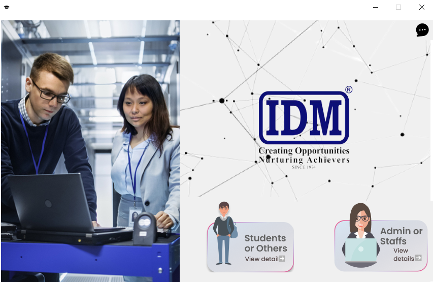

# IDM-SYSTEM [ © R.Sathusan ] :writing_hand:	
The system is designed using **Python** and UI/UX website **Figma**

# Features
This system is Created for IDM campues. It also provides facilities for students to register their 
- **Attendence through the QR code**
- **Know the Time table** of the university over the internet
- **Provide Feedback** about the university over the internet 
- **Download** university related **books** over the internet
- The university will be able to **track feedback on Google Forms** and get student attendence information.
[

